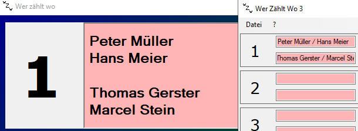

# Wer zählt wo

## Prerequisites
- .NET Framework 4.8
- 2 Bildschirme (z.B. Monitor und Beamer)

## Schnellstart
1. Werzaehltwo3.exe starten
2. Anzahl Felder festlegen
3. Spieler erfassen im Spielereditor
4. Displayfenster auf den 2. Monitor schieben
5. Spieler auf den Feldern eintragen
6. Grüner Haken klicken, um Anzeige zu aktualisieren

## Tipps
### Spieler aus Tournamentsoftware importieren
Die Import-Funktion ist im Spielereditor zu finden.
Zum Importieren aller gemeldeten Spieler muss die entsprechende *.tp-Datei ausgewählt werden.

### Verwalten der Spielerbestände
Im Programmverzeichnis befindet sich die Datei playerboard.json. Falls man z.B. am Morgen und am Nachmittag verschiedene Spieler in der Halle hat, kann man vorgängig verschiedene Versionen der playerboard.json 
vorbereiten und je nach Bedarf im Programmverzeichnis ablegen.

### Doppelpaarungen
Die beiden Namen bei Doppel und Mixed können mit einem " / " getrennt werden. Auf dem Display wird dies dann als Zeilenumbruch angezeigt.

# Anbindung an Tournament Software

WerZaehltWo funktioniert identisch wie der offizielle TournamentTV Client.

## Konfiguration
1. Eigene lokale IP-Adresse ermitteln
2. Im Tournament Software unter Extras -> Turnier TV:
   - die IP-Adresse hinzufügen
   - die Anzahl der angesetzten Spiele auf 100 setzen
3. Im TTV Client-Fenster den Start-Button klicken
4. Funktionstest: Im Tournament Software unter Extras -> Turnier TV den Test-Button klicken
5. Während Turnierbetrieb Rechtsklick auf eine Paarung und im Kontextmenü "Übernahme..." klicken

## Hinweise
- Auslesen sämtlicher Daten entstanden mit Reverse Engineering mittels Wireshark
- Payload ist ein gzip-komprimiertes XML
