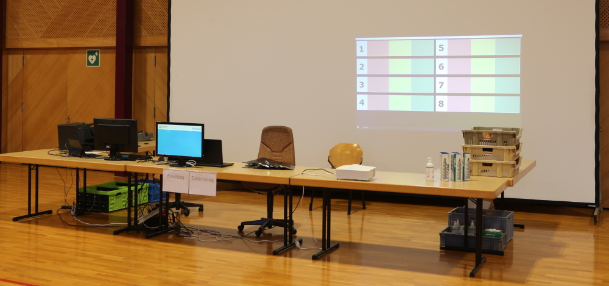

# Wer zählt wo

Hilfsprogramm für Junioren-Badmintonturniere

## Features
- Anzeigen wer auf welchem Feld aktuell spielt, zählen oder sich bereit halten muss
- Import von Spielern aus Badman und TournamentSoftware
- Schnelleingabe von Spielernamen mit Autovervollständigung

## In Progress
- Direkte Anzeige/Import der Felderbelegung aus TournamentSoftware
- Auslesen der geplanten Spiele aus TournamentSoftware

## Todo
- Port nach .NET6 und WPF

# Kontakt
- Bei Fragen und Anregungen: [Github Issues](https://github.com/bc-arbon/WerZaehltWo3/issues) oder [Discord](https://discord.gg/gG7S4y5HZd)

# Installation
- [INSTALL.md](INSTALL.md)
